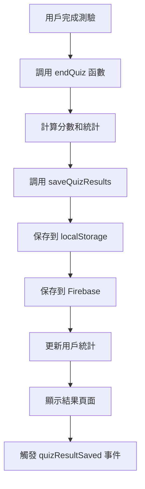

# 測驗結果 Firebase 保存功能指南

## 概述

本功能實現了測驗完成後自動將結果保存到 Firebase 並更新用戶的總測驗次數。當用戶完成筆試測驗並到達結算畫面時，系統會自動：

1. **保存測驗結果**到 Firebase Firestore
2. **更新總測驗次數**（+1）
3. **更新總用時**（累加本次測驗時間）
4. **保存詳細結果**到子集合供歷史查詢

## 功能特性

### ✅ 自動保存
- 測驗完成後自動觸發保存流程
- 無需用戶手動操作
- 異步處理，不阻塞用戶界面

### ✅ 數據完整性
- 同時保存到 localStorage（向後兼容）
- 保存到 Firebase（雲端同步）
- 詳細的測驗結果記錄

### ✅ 統計更新
- 原子性更新總測驗次數
- 累加總用時統計
- 記錄最後測驗時間

### ✅ 錯誤處理
- 網絡錯誤時不影響測驗完成
- 本地數據始終保存
- 詳細的錯誤日誌

## 文件結構

```
src/services/
└── quizResultService.js          # 測驗結果服務

exam_quiz.html                    # 測驗頁面（已更新）
test-quiz-result-firebase.html    # 測試頁面
```

## 核心功能

### 1. 測驗結果服務 (QuizResultService)

```javascript
// 主要方法
await window.quizResultService.saveQuizResult(quizResult);
await window.quizResultService.getUserQuizStats();
await window.quizResultService.getRecentQuizResults(limit);
```

### 2. 測驗結果數據結構

```javascript
const quizResult = {
    score: 85,                    // 分數 (0-100)
    correctAnswers: 17,           // 答對題數
    totalQuestions: 20,           // 總題數
    totalTime: 209,               // 總用時（秒）
    answers: [...]                // 詳細答案數組
};
```

### 3. Firebase 數據結構

#### 用戶文檔更新
```javascript
// 在 'user/{userId}' 文檔中更新
{
    totalTests: increment(1),           // 總測驗次數 +1
    totalTimeSpent: increment(209),     // 總用時累加
    lastQuizDate: serverTimestamp(),    // 最後測驗時間
    updatedAt: serverTimestamp()        // 更新時間
}
```

#### 詳細結果子集合
```javascript
// 在 'user/{userId}/quizResults' 子集合中保存
{
    date: "2024-01-15T10:30:00.000Z",
    score: 85,
    correctAnswers: 17,
    totalQuestions: 20,
    totalTime: 209,
    answers: [...],
    createdAt: serverTimestamp()
}
```

## 使用流程

### 1. 測驗完成流程



### 2. 數據保存流程

1. **測驗結束**：`endQuiz()` 函數被調用
2. **數據計算**：計算分數、答對題數、總用時
3. **本地保存**：保存到 localStorage（向後兼容）
4. **Firebase 保存**：調用 `quizResultService.saveQuizResult()`
5. **統計更新**：使用 `increment()` 原子性更新
6. **詳細記錄**：保存到子集合供歷史查詢
7. **事件觸發**：觸發 `quizResultSaved` 事件

## 集成方式

### 1. 在測驗頁面中

```html
<!-- 載入測驗結果服務 -->
<script type="module">
    import './src/services/quizResultService.js';
</script>
```

### 2. 在測驗結束時

```javascript
// 修改後的 endQuiz 函數
async function endQuiz() {
    // ... 測驗結束邏輯 ...
    
    // 保存結果到 LocalStorage 和 Firebase
    await saveQuizResults(score, correctAnswers, userAnswers.length, totalTime);
    
    // 顯示測驗結果
    showQuizResults(score, correctAnswers, userAnswers.length, totalTime);
}
```

### 3. 監聽保存事件

```javascript
// 監聽測驗結果保存事件
window.addEventListener('quizResultSaved', function(event) {
    console.log('測驗結果已保存:', event.detail);
    // 執行自定義邏輯，如更新 UI
});
```

## 測試方法

### 1. 使用測試頁面

打開 `test-quiz-result-firebase.html` 進行完整測試：

- **模擬測驗結果**：輸入測試數據並保存
- **檢查服務狀態**：驗證服務是否正常初始化
- **獲取用戶統計**：查看總測驗次數是否正確更新
- **獲取最近結果**：驗證詳細結果是否保存

### 2. 實際測驗測試

1. 登入系統
2. 進入測驗頁面
3. 完成一次測驗
4. 查看結算畫面
5. 檢查瀏覽器控制台的日誌
6. 驗證 Firebase 中的數據更新

### 3. 控制台日誌

成功保存時會看到：
```
正在保存測驗結果到Firebase...
✅ 測驗結果已成功保存到Firebase，總測驗次數已更新
```

## 錯誤處理

### 1. 網絡錯誤
- 本地數據仍會保存
- 顯示警告訊息但不阻止測驗完成
- 記錄詳細錯誤日誌

### 2. 用戶未登入
- 檢查用戶登入狀態
- 顯示適當的錯誤訊息
- 不執行 Firebase 保存

### 3. 服務未初始化
- 自動嘗試初始化服務
- 如果失敗則僅保存本地數據
- 記錄初始化錯誤

## 性能優化

### 1. 異步處理
- 所有 Firebase 操作都是異步的
- 不阻塞用戶界面
- 並行處理多個操作

### 2. 原子性更新
- 使用 Firestore 的 `increment()` 操作
- 避免並發更新衝突
- 確保數據一致性

### 3. 錯誤恢復
- 本地數據始終保存
- 網絡恢復後可重新同步
- 詳細的錯誤日誌

## 監控和調試

### 1. 控制台日誌
- 詳細的操作日誌
- 錯誤訊息和堆疊追蹤
- 性能指標記錄

### 2. Firebase 控制台
- 查看 Firestore 數據更新
- 監控讀寫操作
- 檢查安全規則

### 3. 測試工具
- 專用的測試頁面
- 模擬各種場景
- 驗證數據完整性

## 安全考慮

### 1. 用戶驗證
- 檢查用戶登入狀態
- 驗證用戶權限
- 防止未授權訪問

### 2. 數據驗證
- 驗證測驗結果數據
- 防止惡意數據注入
- 限制數據大小

### 3. Firestore 規則
- 配置適當的安全規則
- 限制用戶只能訪問自己的數據
- 防止數據洩露

## 更新日誌

### v1.0.0 (當前版本)
- ✅ 實現測驗結果自動保存
- ✅ 總測驗次數自動更新
- ✅ 詳細結果記錄
- ✅ 錯誤處理和恢復
- ✅ 測試工具和文檔

## 故障排除

### 常見問題

1. **測驗結果未保存**
   - 檢查用戶是否已登入
   - 驗證 Firebase 連接
   - 查看控制台錯誤日誌

2. **總測驗次數未更新**
   - 確認 Firestore 規則允許更新
   - 檢查用戶文檔是否存在
   - 驗證 increment 操作權限

3. **服務初始化失敗**
   - 檢查 Firebase 配置
   - 驗證網絡連接
   - 查看初始化錯誤日誌

### 調試步驟

1. 打開瀏覽器開發者工具
2. 查看 Console 標籤頁的日誌
3. 檢查 Network 標籤頁的請求
4. 使用測試頁面驗證功能
5. 檢查 Firebase 控制台的數據

## 未來擴展

### 計劃功能
- 測驗結果分析報告
- 學習進度追蹤
- 成績趨勢圖表
- 同儕比較功能
- 自動化測試報告

### 性能優化
- 批量操作優化
- 離線數據同步
- 緩存策略改進
- 數據壓縮技術
